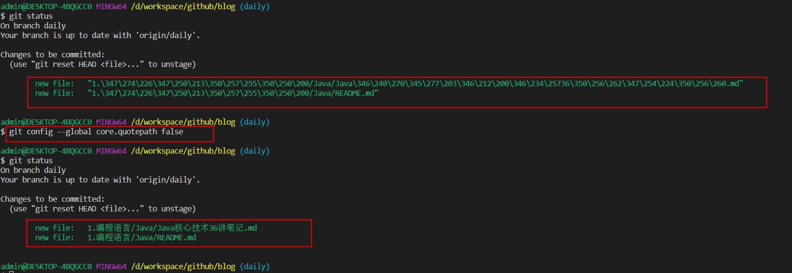

## Git 工具的学习

# git bash 显示中文和解决乱码

- git status 不显示中文问题
    - 症状：在默认设置下，中文文件名在工作区状态输出，中文名不能正确显示，而是显示为八进制的字符编码。
    - 解决：
    - > git config --global core.quotepath false
    - 

- git 中文乱码问题
    - 修改gitconfig配置文件： 
        - 编辑etc\gitconfig文件，也有些windows系统是存放在C:\Users\Administrator\.gitconfig路径或安装盘符:\Git\mingw64\etc\gitconfig，在文件末尾增加以下内容：
    - ``` bash
        [gui]  
        encoding = utf-8  
        # 代码库统一使用utf-8  
        [i18n]  
            commitencoding = utf-8  
            # log编码  
        [svn]  
            pathnameencoding = utf-8  
            # 支持中文路径  
        [core]
            quotepath = false 
            # status引用路径不再是八进制（反过来说就是允许显示中文了）
        ```